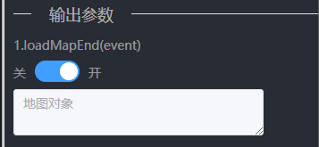

### 1：Uncaught (in promise) TypeError: Converting circular structure to JSON
#### 问题描述
蓝图输入输出显示配置容易报该错误，因为其对象过于复杂，导致无法转换。后端也不会保存该参数值。
#### 解决方案
所传的对象添加以下两个属性值。
map.noSaveFlag = true;
map.noSaveDescribe = "地图对象";

