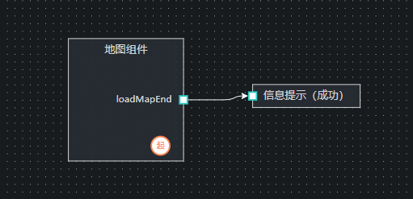

### 1：组件交互方式
（1）在组件代码编写，使用this.$emit方式
```javascript
this.$emit('event', "loadMapEnd", this.map , this.component);
```
（2）传给以下三个文件进行接收
内置组件：src\common\component\PageRender\LayoutRender\LayoutBuildInComponent\index.vue
前端组件：src\common\component\PageRender\LayoutRender\LayoutFrontEndComponent\index.vue
打包组件：packUmdComponent(暂未实现)
```javascript
eventFun(eventType, obj, component) {
      console.log("eventFun--事件类型：", eventType);
      console.log("eventFun--事件传递值：", obj);
      console.log("eventFun--当前组件信息：", component);
      //处理逻辑部分
      //......
}
```
（3）蓝图如有配置"loadMapEnd"即可执行该事件，把事件传递值给下一个蓝图（信息提示（成功）并执行）



