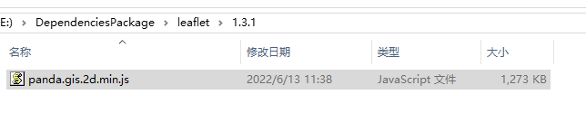

#### 对于组件依赖文件比较多的，可以把相关依赖全打包再一起，如leaflet的相关插件。
#### 缺点：相关依赖一起压缩可能比较大，可用nginx进行gzip访问。

#### leaflet相关插件一起压缩的压缩包大小为1273K

#### nginx的gzip访问大小为384k。
#### nginx的gzip配置如下
```javascript
    gzip  on;
    gzip_min_length  1k;
    gzip_comp_level  6;
    gzip_proxied     expired no-cache no-store private auth;
    gzip_types       text/plain application/x-javascript text/css application/xml application/javascript application/json;
```
#### leaflet的webpack打包配置如下
```javascript
const path = require('path');
const uglify = require('uglifyjs-webpack-plugin');

//webpack -p
module.exports = {
  //mode: "development",
  entry: [
    //leaflet基础依赖
    './static/map/vue-lib/mapjs/leaflet/leaflet/leaflet-src.js',
    './static/map/vue-lib/mapjs/leaflet/proj4/proj4.js',
    './static/map/vue-lib/mapjs/leaflet/proj4/proj4leaflet.js',
    './static/map/vue-lib/mapjs/leaflet/heatmap/leaflet-heat.js',

    //leaflet特色用例依赖
    './static/map/vue-lib/mapjs/leaflet/markercluster/leaflet.markercluster-src.js',
    './static/map/vue-lib/mapjs/leaflet/leaflet-ant-path/leaflet-ant-path.js',
    './static/map/vue-lib/mapjs/leaflet/control/pan/L.Control.Pan.js',
    './static/map/vue-lib/mapjs/leaflet/iconpulse/L.Icon.Pulse.js',
    './static/map/vue-lib/mapjs/leaflet/polylineDoctor/leaflet.polylineDecorator.js',
    './static/map/vue-lib/mapjs/leaflet/animation/AnimatedMarker.js',
    './static/map/vue-lib/mapjs/leaflet/animation/L.Polyline.SnakeAnim.js',
    './static/map/vue-lib/mapjs/leaflet/animation/MovingMarker.js',
    './static/map/vue-lib/mapjs/leaflet/canvas/L.CanvasOverlay.js',
    //标绘依赖
    './static/map/vue-lib/mapjs/leaflet/leafletdraw/Leaflet.draw.js',
    './static/map/vue-lib/mapjs/leaflet/leafletdraw/Leaflet.Draw.Event.js',
    './static/map/vue-lib/mapjs/leaflet/leafletdraw/Toolbar.js',
    './static/map/vue-lib/mapjs/leaflet/leafletdraw/Tooltip.js',
    './static/map/vue-lib/mapjs/leaflet/leafletdraw/Control.Draw.js',
    './static/map/vue-lib/mapjs/leaflet/leafletdraw/ext/GeometryUtil.js',
    './static/map/vue-lib/mapjs/leaflet/leafletdraw/ext/LatLngUtil.js',
    './static/map/vue-lib/mapjs/leaflet/leafletdraw/ext/Polygon.Intersect.js',
    './static/map/vue-lib/mapjs/leaflet/leafletdraw/ext/Polyline.Intersect.js',
    './static/map/vue-lib/mapjs/leaflet/leafletdraw/ext/TouchEvents.js',
    //采集
    './static/map/vue-lib/mapjs/leaflet/leafletdraw/draw/DrawToolbar.js',
    './static/map/vue-lib/mapjs/leaflet/leafletdraw/draw/handler/Draw.Feature.js',
    './static/map/vue-lib/mapjs/leaflet/leafletdraw/draw/handler/Draw.SimpleShape.js',
    './static/map/vue-lib/mapjs/leaflet/leafletdraw/draw/handler/Draw.Polyline.js',
    './static/map/vue-lib/mapjs/leaflet/leafletdraw/draw/handler/Draw.Marker.js',
    './static/map/vue-lib/mapjs/leaflet/leafletdraw/draw/handler/Draw.Circle.js',
    './static/map/vue-lib/mapjs/leaflet/leafletdraw/draw/handler/Draw.CircleMarker.js',
    './static/map/vue-lib/mapjs/leaflet/leafletdraw/draw/handler/Draw.Polygon.js',
    './static/map/vue-lib/mapjs/leaflet/leafletdraw/draw/handler/Draw.Rectangle.js',
    //httpVueLoader依赖
    './static/map/vue-lib/vuejs/httpVueLoader.js',
    //修改
    './static/map/vue-lib/mapjs/leaflet/leafletdraw/edit/EditToolbar.js',
    './static/map/vue-lib/mapjs/leaflet/leafletdraw/edit/handler/EditToolbar.Edit.js',
    './static/map/vue-lib/mapjs/leaflet/leafletdraw/edit/handler/EditToolbar.Delete.js',
    './static/map/vue-lib/mapjs/leaflet/leafletdraw/edit/handler/Edit.Poly.js',
    './static/map/vue-lib/mapjs/leaflet/leafletdraw/edit/handler/Edit.SimpleShape.js',
    './static/map/vue-lib/mapjs/leaflet/leafletdraw/edit/handler/Edit.Rectangle.js',
    './static/map/vue-lib/mapjs/leaflet/leafletdraw/edit/handler/Edit.Marker.js',
    './static/map/vue-lib/mapjs/leaflet/leafletdraw/edit/handler/Edit.CircleMarker.js',
    './static/map/vue-lib/mapjs/leaflet/leafletdraw/edit/handler/Edit.Circle.js',
    //mapv
    './static/map/vue-lib/mapv/mapv.js',

    './static/map/vue-lib/mapjs/leaflet/polylineoffset/leaflet.polylineoffset.js',
    //path 可拖动
    './static/map/vue-lib/mapjs/leaflet/drag/L.Path.Drag-src.js',
    //椭圆
    './static/map/vue-lib/mapjs/leaflet/ellipse/l.ellipse.js',

    //军事标绘
    './static/map/vue-lib/mapjs/leaflet/plot/Plots.js',
    './static/map/vue-lib/mapjs/leaflet/plot/PlotUtil.js',

    //碰撞
    './static/map/vue-lib/mapjs/leaflet/collision/Leaflet.LayerGroup.Collision.js'
  ],
  output: {
    filename: 'panda.gis.2d.min.js',
    path: path.resolve(__dirname, 'static/map/vue-lib/'),
  },

  module: {
    rules: [
      {
        test: /\.css$/,
        use: ['style-loader', 'css-loader']
      }, {
        test: /\.(png|gif|svg)/,
        use: [{
          loader: 'url-loader',
          options: {
            limit: 500000
          }
        }]
      }
    ]
  },
  //watch: true,   // 监听修改自动打包
  plugins: [
    new uglify()
  ],
  devServer: {}
}
```


