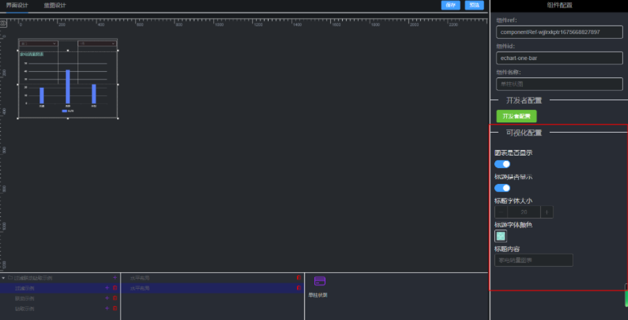

## 组件可视化配置参数介绍
组件可视化配置后，可在界面搭建的时候出现可视化参数的调整。如下所示

### 1、参数类型
|  字段名   | 字段描述  |
|  ----  | ----  |
| num  | 数字 |
| string  | 字符串 |
| boolean  | 布尔值 |
| color  | 颜色 |
| photo  | 图片 |
### 2、参数所对应的值与效果图
#### （1）num
option.title.textStyle.fontSize=20

#### （2）string
option.title.text="家电销量图表"

#### （3）boolean
option.title.show=true

#### （4）color
option.title.textStyle.color="rgba(255, 255, 255, 1)"

#### （5）photo
option.url="http://10.11.0.87:8087/cbc/getFile.cbc?uuid=873964dd6a4e40bfb7bdee8c5f4df39e&type=photo"

